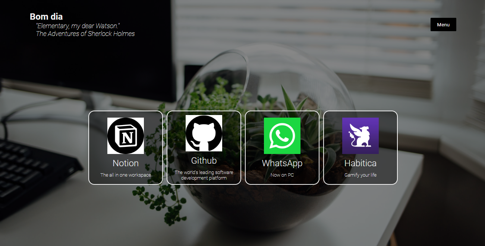
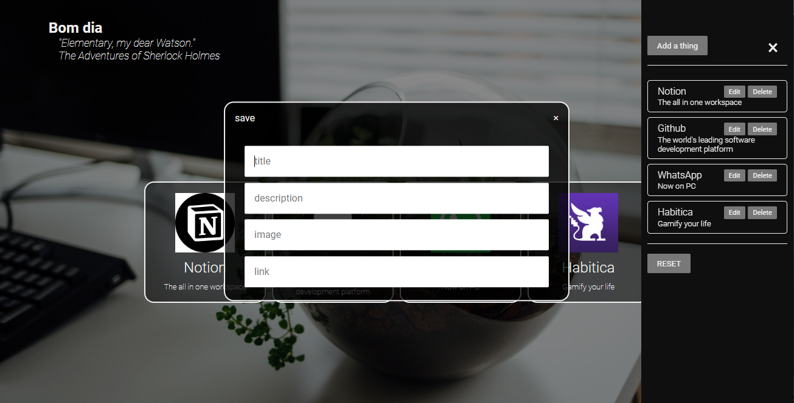

# Dashboard

## :heavy_check_mark: Features:

- Quick way to access all your most used sites
- Everything is local
- Quote from movies :)
- Uses local storage

## Usage example

## :computer: Development setup

All its done with _vanilla_ javascript

Check out the [`script.js`](./script.js) and the [`quotes.js`](./quotes.js) to cahnge the features

On `script.js`, change the localstorage key to whatever you need it to be

## :rocket: Release History

- 1.0.0 (2020/09/15)

## About Me

Diego Lopes Ferreira – [@Twitter](https://twitter.com/Diego_simSouEu) – [@Instagram](https://www.instagram.com/diego.lopes.f/) - [LinkedIn](https://www.linkedin.com/in/diego-lopes-ferreira-a23a8919b/) - [Coders Rank](https://profile.codersrank.io/user/diego-lopes-ferreira)

Distributed under the MIT license. See [license](LICENSE) for more information.
